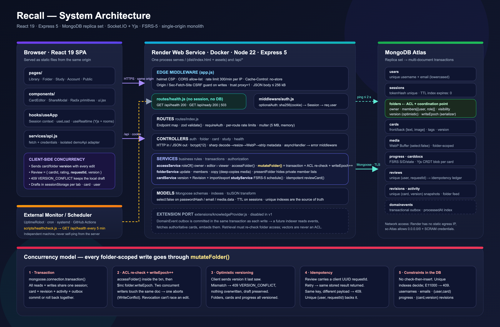

# Recall

A collaborative flashcard application built with **React, Express, and MongoDB**. The UI uses Radix primitives, Lucide icons, and a custom responsive design system. AI and RAG are intentionally disabled; an extension interface and transactional domain events provide a future integration boundary.

## What is included

- Accounts with unique, normalized usernames; password hashing and opaque HttpOnly sessions.
- Private and global folders; every card belongs to exactly one folder.
- Two-sided text and image cards, tags, hints, source links, bookmarks, search, and per-tab drafts.
- Sharing with existing users by username, with owner/editor/viewer permissions.
- Collaborative editing with version conflict detection, change history, and restoration into a new draft.
- Folder activity and polling for committed changes every 15 seconds while viewing a folder.
- Global discovery, public profiles, anonymous public-card viewing, saved collections, and private copies.
- Quick review, due-card study, review scheduling, daily goals, personal progress, and keyboard shortcuts.
- Archive and restore folders; confirmed permanent deletion of individual cards.
- Permission-checked image delivery. Images are decoded, resized, stripped of metadata, and stored in MongoDB.
- Light and dark themes. The toggle in the top bar (and on the sign-in and public pages) saves the choice in `localStorage`; with no saved choice the app follows the OS preference. `public/theme.js` applies the theme before first paint, as a file rather than inline because the CSP forbids inline scripts.

## Preview versus the full application

The hosted preview is an explicitly labelled, **in-memory sample workspace**. It resets on refresh. It does not create real accounts, persist uploads, or collaborate across browsers. Real API failures never silently switch the production app into demo mode.

The downloadable source includes the complete Express API and MongoDB models. Run the full app below for real accounts and shared durable data. The preview hosting platform does not run the Node server or a MongoDB database.

## Quick start with Docker

Prerequisites: Docker with Compose.

```bash
docker compose up --build
```

Open **http://localhost:4000** and create an account. Create a second account in another browser profile, then share a folder using that account's username. No email service is needed for username-based access grants.

Compose runs a persistent, single-node MongoDB replica set and Express serving the built React app. It binds published ports to localhost. The bundled unauthenticated MongoDB container is for local development only.

## Development without Docker

Use Node 22 or newer and npm.

```bash
npm ci
cp .env.example .env
```

Either point `MONGODB_URI` at an authenticated MongoDB replica set (for example your Atlas database) and run:

```bash
npm run dev:server
```

Or start a local development MongoDB replica set plus API:

```bash
npm run dev:local
```

In a second terminal:

```bash
npm run dev
```

Open **http://localhost:4173**. Vite proxies `/api` to Express on port 4000. `dev:local` uses the official MongoDB binary through mongodb-memory-server and stores local data in `.local-data/mongo`; the first run may download the binary. Environments that block MongoDB processes should use Docker or an external replica set.

Optional sample data:

```bash
npm run dev:local -- --seed
```

The seed creates a `learner` account with a randomly generated development password printed locally. Set `SEED_PASSWORD` to choose one. Seeding does not overwrite existing folders and is refused in production.

To run only the temporary UI preview:

```bash
VITE_DEMO_MODE=true npm run dev
```

Do not set `VITE_DEMO_MODE=true` for the real application. If switching from preview development, remove that value from `.env.local`.

## Architecture



*Vector source: [`docs/architecture.svg`](docs/architecture.svg).*

Recall is a **single-origin monolith**: one Node process serves the compiled React app from `dist/` and the JSON API under `/api`. There is no separate frontend server, no gateway, and no message broker in v1. The whole system is three boxes: browser, Express, MongoDB replica set.

### Layered backend (MVC + service layer)

| Layer | Directory | Owns | Never does |
| --- | --- | --- | --- |
| Edge middleware | `server/src/app.js` | Helmet CSP, CORS allow-list, rate limiting, CSRF origin guard, JSON body limit, static file serving, central error mapping | Business rules |
| Routes | `server/src/routes` | URL → handler mapping, `zod` input validation, `requireAuth`, per-route rate limits, multer upload limits | Touch models directly |
| Controllers | `server/src/controllers` | Translate HTTP ↔ service calls, status codes, image decoding with `sharp`, password hashing | Transactions or authorization decisions |
| Services | `server/src/services` | Authorization (`roleOf`, `accessFolder`), transactions (`mutateFolder`), versioning, idempotency, scheduling algorithm, activity/outbox writes | Know about `req`/`res` |
| Models | `server/src/models` | Mongoose schemas, indexes, `select: false` on secrets, `toJSON` transform (`_id` → `id`, drop `__v`) | Contain logic |
| Extensions | `server/src/extensions` | `KnowledgeProvider` port for future AI/RAG; disabled | Run in v1 |

Every handler is wrapped in `asyncHandler`, so rejected promises flow to one error middleware that maps `ZodError` → 400, duplicate key `E11000` → 409, `CastError` → 404, `LIMIT_FILE_SIZE` → 400, `AppError` → its status, and anything else → generic 500 with the stack logged server-side only.

### Frontend structure

| Directory | Responsibility |
| --- | --- |
| `client/src/pages` | Route-level views (Library, Folder, Study, Account, Public) |
| `client/src/components` | Reusable presentation: `CardEditor`, `ShareModal`, `FolderModal`, Radix-based `ui.jsx` primitives |
| `client/src/hooks/useApp.jsx` | Session context (`/auth/me` on boot), `useLoad` data-fetching hook with cancellation on unmount |
| `client/src/services/api.js` | Single `fetch` wrapper: `credentials: 'include'`, JSON handling, error objects carrying `status` and `code` |
| `client/src/services/demoApi.js` | Explicitly isolated in-memory adapter for the hosted preview; never activated by API failures |
| `shared` | Authored sample content used by the seed and the preview |

### Request lifecycle (authenticated write)

1. Browser `fetch('/api/cards/:id', { method: 'PATCH', body: { ...fields, version } })` with the session cookie.
2. `helmet` → `cors` → global rate limit (300/min/IP) → `Cache-Control: no-store` → **CSRF guard**: non-GET requests get 403 unless their `Origin` host equals the request `Host` (same-origin) or is in `CLIENT_ORIGIN`; `Sec-Fetch-Site: cross-site` is always rejected.
3. `express.json` (256 kB cap) → `cookieParser` → `optionalAuth`: `sha256(cookie)` looked up in `sessions`, unexpired → `req.user`.
4. Route: `requireAuth` → `validate(cardSchema.extend({ version }))` → controller.
5. Controller calls `cardService.updateCard`, which calls `mutateFolder(folderId, user, 'editor', op)`.
6. Inside one MongoDB transaction: re-load folder, compute role, assert permission, `$inc writeEpoch`, compare `card.version`, write a `Revision` snapshot, save the card with `version + 1`, append `Activity`, append `DomainEvent`. Commit.
7. Controller returns `{ card }`; the client replaces its copy and the new `version`.

## Design deep dive

This section is written to answer "why is it built this way?" — the questions that come up in design reviews and interviews.

### Authentication

- **Opaque session tokens, not JWTs.** A 32-byte random token is set as an `HttpOnly`, `SameSite=Lax`, `Secure` (in production) cookie. Only its SHA-256 hash is stored in `sessions`, so a database leak does not yield usable tokens. Revocation is immediate (`logout` deletes the row); JWTs would need a denylist to achieve the same.
- **TTL index** (`expiresAt`, `expires: 0`) lets MongoDB garbage-collect expired sessions without a cron job.
- **Passwords** are `bcrypt` with cost 12; `passwordHash` and `email` are `select: false` so they never appear in a query result unless explicitly requested.
- **Login rate limit** of 30 per 15 minutes per IP on `/auth/*` slows credential stuffing.
- **Username uniqueness is enforced by a unique index, not a "check if taken" call.** Two concurrent signups with the same name race to the index; the loser receives `E11000`, mapped to 409. This removes the classic TOCTOU bug.

### Authorization model

Roles are computed per request by `roleOf(folder, user)`:

```text
owner   → the folder's owner field
editor  → listed in folder.members with role 'editor'
viewer  → listed with role 'viewer', or anyone if folder.visibility === 'global'
null    → no access; the API answers 404, not 403, so private folders are not enumerable
```

`accessFolder(id, user, level, session)` is the single choke point. It runs **inside the transaction** for writes, so a permission check can never be stale relative to the write it protects. Images are checked the same way: `/api/media/:id` loads the media's folder and calls `accessFolder`, then responds with `Cache-Control: private, no-store` so a shared URL is never a credential. Public folder responses strip the member list for non-members.

### Concurrency control

Recall has real multi-user editing, so it needs answers for lost updates, permission races, retries, and duplicates. Five mechanisms cover them:

| Problem | Mechanism | Where |
| --- | --- | --- |
| Partial writes (card saved, revision lost) | **Multi-document transaction** via `mongoose.connection.transaction()` — card, revision, activity, and outbox commit or roll back together | `accessService.mutateFolder` |
| Owner revokes access while an editor's write is in flight | **Serialize on the folder document**: every folder-scoped write `$inc`s `folder.writeEpoch` inside the transaction. Two transactions touching the same document conflict; MongoDB aborts one with `WriteConflict` and Mongoose retries it, which re-runs the permission check against the committed state | `mutateFolder` |
| Two editors save the same card (lost update) | **Optimistic concurrency**: the client sends the `version` it last read; the server compares and returns `409 VERSION_CONFLICT` on mismatch without overwriting. The UI keeps the local draft and tells the user to review the other change | `cardService.updateCard`, `folderService.updateFolder`, `studyService.reviewCard` |
| A study rating is submitted twice (network retry, double tap) | **Idempotency key**: each review carries a client-generated UUID `requestId`; `(user, requestId)` is a unique index. A repeat returns the stored result; the same key with a different payload returns 409 | `studyService.reviewCard` |
| Duplicate usernames, duplicate progress rows, duplicate revisions | **Unique indexes as the source of truth**: `users.username`, `users.email`, `progress(user, card)`, `reviews(user, requestId)`, `revisions(card, version)`. No check-then-insert anywhere | `models/index.js` |

Why the `writeEpoch` trick matters: MongoDB transactions use snapshot isolation, so two transactions that read the same folder but write *different* documents would both commit — a revoked editor could still land a card edit that started before the revocation. By making every write also modify the folder document, the two transactions collide and one is retried, so the retry sees the revocation.

Why optimistic rather than pessimistic locking: edits are rare relative to reads, sessions are long, and a stuck lock from a closed tab would block collaborators. Optimistic versioning is lock-free and degrades gracefully to a user-visible conflict.

### Data model

```text
users ──< folders ──< cards ──< revisions
  │          │          │
  │          │          └──< progress (per user × card, unique)
  │          ├──< media   (folder-scoped WebP blobs)
  │          ├──< activity (human-readable feed)
  │          └──< domainevents (outbox)
  └──< sessions (TTL) · reviews (idempotency ledger) · savedFolders[]
```

- **Folder is the aggregate root** for authorization and concurrency. Cards do not carry their own ACL; they inherit from the folder, which keeps permission logic in one place.
- **Progress is per user, not per card.** Collaborators share cards but never share study state or ratings.
- **Copies are independent.** `copyFolder` deep-copies cards *and* referenced media inside one transaction, so a copy keeps working after access to the original is revoked. `originalCreator` preserves attribution.
- **Revisions store the previous snapshot**, not a diff — simple, and restore is "load into draft, save as a new version," so history is never rewritten.
- **Images live in MongoDB** for v1 (≤ 3 MB after processing). This keeps deployment to "Node + Mongo" and makes permission checks trivial. Object storage with signed URLs is the documented scale-out path.
- Indexes follow the queries: `folders(owner, updatedAt)`, `folders(members.user)`, `folders(visibility, archived)`, `cards(folder, createdAt)`, `cards(folder, tags)`, `activity(folder, createdAt)`, `domainevents(processedAt, createdAt)`.

### Collaboration model

Conflict-aware editing with polling, deliberately not CRDTs or live cursors. While a folder is open, the client refetches every 15 seconds (paused when the tab is hidden or an editor modal is open). Writes are last-writer-wins *only if* the version matches; otherwise the user sees a conflict and their draft is preserved in `sessionStorage`. The `Activity` feed gives a human-readable audit trail. This is the right cost/benefit for flashcards: edits are short, rare, and card-scoped, so operational transforms would add complexity without user-visible benefit.

### Spaced repetition

`schedule(previous, rating)` is an SM-2-style interval algorithm: `again` resets repetitions and re-queues in 10 minutes; `hard` grows the interval by 1.2× (min 1 day) and lowers ease; `good` follows 1 → 3 → interval × ease; `easy` grows by ease × 1.3 (min 4 days) and raises ease. Ease is floored at 1.3. It is a pure function with unit tests, so it can be swapped for FSRS later without touching the transaction code. Daily goals use UTC boundaries.

### Security controls

| Threat | Control |
| --- | --- |
| XSS | Helmet CSP: `script-src 'self'`, no inline scripts; React escaping; cards are plain text |
| CSRF | `SameSite=Lax` cookie + `Origin`/`Sec-Fetch-Site` check on every non-GET `/api` request. Same-origin is detected by comparing the `Origin` host with the `Host` header; a browser never lets attacker JS forge `Origin`, so this cannot be bypassed from a foreign page |
| Malicious uploads | `sharp` decodes and re-encodes every image to WebP: rejects non-images regardless of extension/MIME, strips EXIF, caps dimensions (1600 px) and pixel count (25 MP), 5 MB upload / 3 MB stored |
| Credential leaks | `select: false` on secrets, hashed session tokens, hashed passwords, no secrets in `/api/health` |
| Enumeration | Private folders return 404 for outsiders; public profiles show only `name`, `username`, `bio` |
| Brute force / abuse | Global 300 req/min/IP, auth 30/15 min, uploads 20/min |
| Injection | `zod` validates every body; Mongoose casts ids; `CastError` → 404 |
| Clickjacking / sniffing | Helmet defaults (`frame-ancestors`, `X-Content-Type-Options: nosniff`) |

### Extension boundary (AI / RAG later)

The `DomainEvent` collection is a **transactional outbox**: every write appends an event in the same transaction, so downstream consumers never see an event for a write that rolled back, and never miss a committed one. Events carry ids, not card text, so a future indexer must fetch the authoritative card and re-check folder access. The `KnowledgeProvider` class defines `indexFolder`, `removeFolder`, and `retrieve(query, authorizedFolderIds)` and throws in v1. Nothing in the hot path depends on it.

### Operability

- `GET /api/health` — liveness, no database, always 200. Mounted **before** cookie/session middleware so a monitor can never trigger a database query.
- `GET /api/ready` — readiness, pings MongoDB with a bounded timeout, 503 when down. Safe body, no internals.
- Graceful shutdown on `SIGINT`/`SIGTERM`: stop accepting, drain, disconnect Mongoose.
- Rate limiting is per process; multiple replicas need a shared store — documented in *Scope and limits*.

### Trade-offs and what changes at scale

| Decision | Why now | Next step when it hurts |
| --- | --- | --- |
| Monolith, same origin | Zero CORS/cookie complexity, one deploy, one health check | Split static assets to a CDN; keep API monolith |
| Images in MongoDB | No extra service; ACL check is one query | S3/GCS + signed URLs, keep metadata in Mongo |
| Polling every 15 s | Trivial, stateless, works through any proxy | SSE or WebSockets fed by the outbox |
| In-process rate limiter | No Redis | Redis store or edge/WAF rate limiting |
| Optimistic versioning | Lock-free, matches edit frequency | Field-level merges or CRDT only if simultaneous editing becomes a requirement |
| Transactions on every write | Correctness first; write volume is low | Partition hot folders; reads already avoid transactions |
| Opaque sessions in Mongo | Instant revocation, simple | Redis session cache in front of Mongo |
| 200-folder list cap, no cursor pagination | Personal libraries are small | Cursor pagination on `(updatedAt, _id)` |

## Data and concurrency rules (summary)

- A unique database index, not a preflight availability check, guarantees username uniqueness. Usernames normalize to lowercase.
- Folder-scoped writes execute in MongoDB transactions and also update the folder access document. Revocations and concurrent mutations therefore serialize on that document.
- Folder, card, and progress edits carry a `version`. A stale edit returns HTTP 409 without replacing the current content.
- Reviews use a unique `(user, requestId)` key plus a progress version. Retrying the same request returns its prior result; different concurrent reviews with an old progress version conflict.
- Each learner has their own `(user, card)` progress record. Collaboration never shares study ratings.
- Read access to private folders and their images is checked on each API request. Images use `Cache-Control: private, no-store`.
- Public folder responses hide private membership lists from nonmembers. Permission is never derived from a shared URL.
- Copies duplicate referenced media, so the copy does not depend on access to the original folder.
- Version history records the previous card snapshot. Restoring loads it as a draft; saving creates another version.

A MongoDB replica set is required for transactions. These safeguards have targeted integration tests; see TESTING.md for the verification status in the build environment.


## Deployment

Only **a Node-compatible host and MongoDB** are required. Redis, a vector database, email, S3, and paid AI services are not required for v1. Fonts and UI assets are bundled locally.

```bash
npm ci
npm run build
NODE_ENV=production npm start
```

The standard build explicitly disables demo mode. Express serves the React build and API from the same origin, which is the recommended deployment layout. Configure:

| Variable | Purpose |
| --- | --- |
| `MONGODB_URI` | Authenticated replica-set connection string; keep server-side |
| `CLIENT_ORIGIN` | Optional for same-origin deployments (requests from the app's own host are always trusted). Set to the exact frontend origin(s), comma-separated, only when the frontend is hosted separately |
| `PORT` | Server port; default 4000 |
| `NODE_ENV` | Set to `production` behind HTTPS for secure session cookies |
| `TRUST_PROXY` | Set to `1` only behind exactly one trusted reverse proxy |
| `VITE_API_URL` | Optional API origin when building a separately hosted frontend |
| `READINESS_TIMEOUT_MS` | Max wait for the MongoDB ping in `GET /api/ready`; default 2000 |
| `HEALTHCHECK_URL` | Used only by `scripts/healthcheck.js` on the monitoring machine, never by the server |

For separate frontend/API hosting, use the same site (for example `app.example.com` and `api.example.com`) because session cookies use SameSite=Lax. Configure the exact frontend origin in CORS and rebuild with the API origin. Do not expose database credentials using any `VITE_` variable.

The Dockerfile builds the real app, not the preview. Use HTTPS at your host or reverse proxy and an authenticated database for a live service. The included Compose file is a development configuration, not an internet-facing production topology.

## Health monitoring

Recall exposes two public, unauthenticated endpoints. Neither returns connection strings, error messages, or other internals.

| Endpoint | Meaning | Response |
| --- | --- | --- |
| `GET /api/health` | **Liveness** — the Express process is up and serving requests. Does not touch MongoDB. | Always `200 {"ok":true,"app":"recall","storage":"mongodb"}` |
| `GET /api/ready` | **Readiness** — the app can serve real traffic. Pings MongoDB with a short timeout (`READINESS_TIMEOUT_MS`, default 2 s). | `200 {"ok":true,"status":"ready",...}` or `503 {"ok":false,"status":"unavailable",...}` |

Use liveness to detect a crashed or sleeping process (and to wake an idle host). Use readiness to decide whether the instance should receive traffic — a load balancer, orchestrator, or uptime monitor should alert on readiness, because a live process with an unreachable database still fails every real request. Both routes are mounted before session handling, so a stale cookie never causes a database lookup.

Local check while the dev server is running:

```bash
curl -i http://localhost:4000/api/health
curl -i http://localhost:4000/api/ready
HEALTHCHECK_URL=http://localhost:4000/api/health npm run healthcheck   # exits 0
HEALTHCHECK_URL=http://localhost:4999/api/health npm run healthcheck   # exits 1 after one retry
```

### Scheduled external pings

`scripts/healthcheck.js` is a standalone Node 22+ script (built-in `fetch`, no dependencies). It calls `HEALTHCHECK_URL` once with a 10-second timeout, retries at most once, prints a timestamped line per attempt, and exits `0` healthy / `1` unhealthy / `2` misconfigured. Run it every 5 minutes from a machine that is **independent of the Recall host** — a home server, a VPS, a CI runner — so the schedule keeps firing while Recall is asleep or down. Ready-made configurations live in `scheduling/` (cron, systemd timer, GitHub Actions example); see `docs/MONITORING.md` for setup steps.

Recall deliberately does **not** ping itself with `setInterval` or `node-cron`: a sleeping host cannot run its own timer, and a self-ping only proves the process can reach itself. Scheduled external requests can reduce idle shutdowns on free-tier hosts, but they do not guarantee uptime, do not bypass hosting usage limits or instance-hour caps, and may themselves be delayed by the scheduler. Treat them as best-effort signal, not as an SLA.

An external HTTP monitoring service (for example UptimeRobot, Better Stack, Healthchecks.io, Pingdom, or a cloud provider's uptime check) can call `https://<your-host>/api/health` directly on a 5-minute interval and alert when it stops returning HTTP 200 — no script or scheduler is needed. Point a second check at `/api/ready` to catch database outages. Nothing in this repository provisions, pays for, or deploys such a service.

## Future AI and RAG

`KnowledgeProvider` defines disabled indexing/retrieval methods. The `DomainEvent` outbox is committed with card changes. A later indexer can read committed events, fetch authoritative cards, and create embeddings without slowing card writes. No event consumer, AI model, embeddings, or vector service runs in this version.

Before enabling RAG, enforce folder access again during retrieval, process privacy changes and deletions, index card versions, and remove stale vectors. A vector index must never become an authorization source. Treat retrieved card text as untrusted data.

## Scope and limits

- Collaboration is conflict-aware editing plus polling, not simultaneous character-level editing or live cursors.
- Folder queries return up to 200 collections; large-scale cursor pagination and indexed search are future work.
- Rate limiting is per Node process. Multiple replicas should share a Redis-backed limit store or use an edge gateway.
- Image documents are capped at 3 MB after processing. Object storage, total-user quotas, and orphan-media cleanup are future scaling work.
- Public account recovery, email verification, moderation/reporting, data export, and account deletion are not implemented in v1.
- Cards use plain text; rich text, nested folders, import/export, reminders, and offline synchronization are not implemented.
- Scheduling uses a documented simple interval algorithm, not an implementation of FSRS or a claim of optimal retention.
- UTC defines daily-goal boundaries.

## Commands

```bash
npm test                  # Core checks; database integration cases reported as skipped
npm run test:integration  # Real MongoDB replica-set integration tests
npm run build             # Real API-backed React build
npm run build:preview     # Explicit in-memory UI preview build
npm run healthcheck       # One external liveness ping of HEALTHCHECK_URL; exit 0/1/2
```

Integration tests use a newly named temporary database and delete only that database on completion. `TEST_MONGODB_URI` can point at a test replica set if a local MongoDB process is unavailable.
