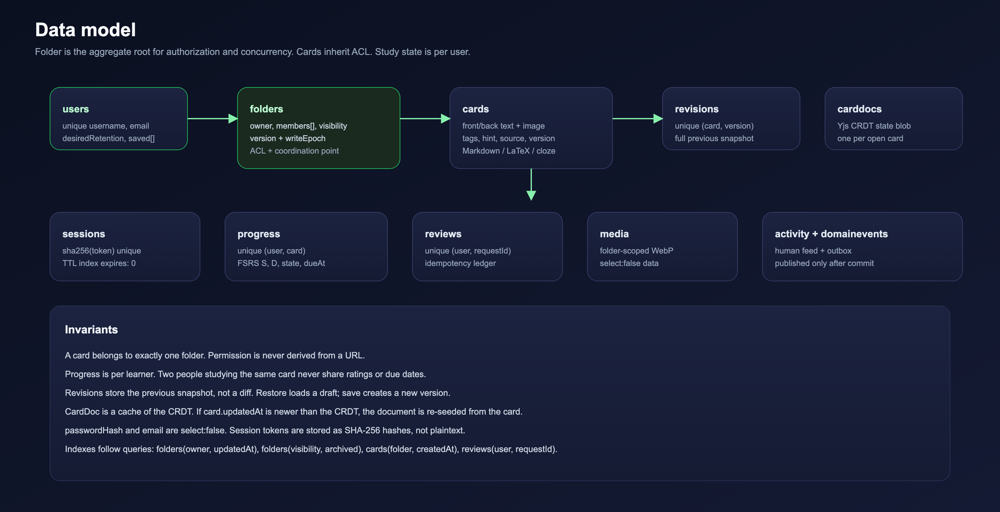
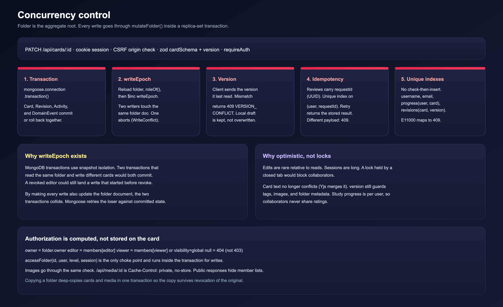
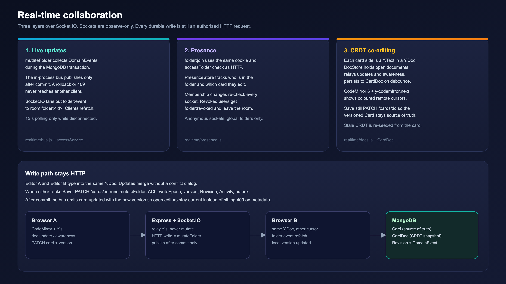

# Recall

Collaborative flashcards: React 19, Express 5, MongoDB replica set. One Node process serves the compiled UI from `dist/` and the JSON API under `/api`.

## System architecture


*Vector: [`docs/architecture.svg`](docs/architecture.svg).*

Recall is a **single-origin monolith**. The browser talks HTTPS to Express. Express talks TLS to a MongoDB replica set (required for multi-document transactions). There is no API gateway and no message broker.

| Layer | Directory | Owns |
| --- | --- | --- |
| Edge | `server/src/app.js` | Helmet CSP, CORS, rate limits, CSRF origin guard, static `dist/`, error mapping |
| Routes | `server/src/routes` | URL map, `zod` validation, `requireAuth`, upload limits |
| Controllers | `server/src/controllers` | HTTP in / JSON out. No transactions, no ACL decisions |
| Services | `server/src/services` | Authorization, `mutateFolder` transactions, FSRS, import parsers, stats |
| Realtime | `server/src/realtime` | Socket.IO: post-commit event bus, presence, Yjs documents, live quiz rooms |
| Models | `server/src/models` | Schemas, unique indexes, `select: false` on secrets |
| Client | `client/src` | Pages, `useApp` session, `useRealtime` hooks, CodeMirror + Yjs editor |

**Write lifecycle.** `PATCH /api/cards/:id` with the session cookie → CSRF check (`Origin` host equals `Host`, or listed in `CLIENT_ORIGIN`; `Sec-Fetch-Site: cross-site` rejected) → `optionalAuth` looks up `sha256(cookie)` in `sessions` → `requireAuth` + `zod` → `cardService.updateCard` → `mutateFolder` inside one transaction → `{ card }` with the new `version`.

## Data model



*Vector: [`docs/data-model.svg`](docs/data-model.svg).*

Folder is the **aggregate root**. Cards do not carry an ACL; they inherit from the folder. Progress is unique on `(user, card)` so collaborators never share ratings. Revisions store the previous full snapshot. `CardDoc` caches Yjs state for open cards and is re-seeded from `Card` if the card is newer.

Social graph is a single `relationships` collection: unique `(from, to, kind)` with `kind` `follow` or `connect` and `status` `active` or `pending`. Profiles store only `followers` / `following` / `friends` counts (`$inc` on write). Follow and friendship never grant folder access. Folder `likeCount` / `copyCount` are denormalized; likes reuse `savedFolders`. A **project** is owner-scoped, private or global, and holds folder ids (`$addToSet`). A folder can sit in many projects or none.

## Concurrency control



*Vector: [`docs/concurrency.svg`](docs/concurrency.svg).*

| Problem | Mechanism | Where |
| --- | --- | --- |
| Partial writes | Multi-document transaction: card, revision, activity, outbox commit or roll back together | `accessService.mutateFolder` |
| Revoke while a write is in flight | Every folder-scoped write `$inc`s `folder.writeEpoch` inside the transaction so two writers collide on the same document. MongoDB aborts one (`WriteConflict`); Mongoose retries it against committed state, which re-runs the ACL check | `mutateFolder` |
| Two editors save the same metadata | Optimistic `version` on folder, card, and progress. Stale write → `409 VERSION_CONFLICT`, local draft kept | `cardService`, `folderService`, `studyService` |
| Double-submitted review | Client UUID `requestId`. Unique `(user, requestId)`. Retry returns the stored result; same key, different payload → 409 | `studyService.reviewCard` |
| Duplicate usernames / progress / revisions | Unique indexes are the source of truth. No check-then-insert. `E11000` → 409 | `models/index.js` |

`writeEpoch` exists because snapshot isolation would otherwise let two transactions that write *different* cards both commit after reading the same folder — including a write that started before the owner revoked access.

Authorization is computed by `roleOf`: owner, editor, viewer (explicit or `visibility === 'global'`), or `null`. Outsiders get **404**, not 403. `accessFolder` is the only choke point and runs **inside the transaction** for writes. `/api/media/:id` uses the same check and `Cache-Control: private, no-store`.

Sessions are opaque: 32-byte token in an `HttpOnly` `SameSite=Lax` cookie; only the SHA-256 hash is stored. Passwords are bcrypt cost 12. `passwordHash` and `email` are `select: false`.

## Features and how they are implemented

### Real-time collaboration



*Vector: [`docs/collaboration.svg`](docs/collaboration.svg).*

Three layers. Sockets never mutate data.

1. **Live updates.** `mutateFolder` collects events during the transaction and publishes on `realtime/bus.js` only after commit. Socket.IO emits `folder:event` to `folder:<id>`. A rolled-back or conflicted write is never broadcast. Clients refetch. Polling (15 s) runs only while the socket is down.
2. **Presence.** `folder:join` uses the same cookie and `accessFolder` as HTTP. `PresenceStore` tracks who is viewing and which card they are editing. Membership changes re-check every socket and emit `folder:revoked`.
3. **CRDT co-editing.** Each card side is a `Y.Text`. `DocStore` relays updates and cursor awareness, persists to `CardDoc`. CodeMirror 6 + `y-codemirror.next` draws coloured remote cursors. Concurrent inserts merge. **Save is still `PATCH /cards/:id`**, so the versioned `Card` remains the source of truth (history, restore, ACL). If nobody is co-editing and the card is newer than the CRDT, the document is re-seeded from the card.

### FSRS scheduling and retention

`server/src/services/fsrs.js` implements FSRS-5. Each learner × card stores stability **S**, difficulty **D**, and state. Retrievability is `R = (1 + 19/81 · t/S)^-0.5`. The next interval is the time at which R would fall to the learner's desired retention (default 90%, Settings 70–97%). `again` re-queues in 10 minutes. Legacy SM-2 rows convert (`interval → S`, `ease → D`). Study buttons show the interval each rating would produce.

`statsService` aggregates predicted vs observed retention, a 14-day due forecast, memory-state counts, hardest cards, a 26-week heatmap, streaks, rating mix, and hour/weekday insights from the review log.

### Import and export

`importService` is a set of pure parsers. Upload is two-step: `POST /folders/:id/import?dryRun=1` returns `{ format, total, sample }`; confirm inserts up to 2,000 cards in one transaction.

| Format | Sample file (download from the import dialog) |
| --- | --- |
| JSON | [`public/import-templates/dummy.json`](public/import-templates/dummy.json) — `{ "cards": [{ "front": { "text" }, "back": { "text" }, "tags", "hint", "source" }] }` |
| CSV / TSV | [`public/import-templates/dummy.csv`](public/import-templates/dummy.csv) — header `front,back,tags,hint,source` (aliases like question/answer work) |
| Markdown | [`public/import-templates/dummy.md`](public/import-templates/dummy.md) — `Q:`/`A:` blocks, headings, `term :: definition` |
| Anki text | [`public/import-templates/dummy.txt`](public/import-templates/dummy.txt) — `#separator:tab` plus tab-separated fields |

`.apkg` is a zip + SQLite collection (`sql.js`). Export is `GET /folders/:id/export` (JSON) or `?format=csv`.

### Rich text: Markdown, LaTeX, cloze

Source is stored as plain text. `RichText.jsx` renders: cloze markers → `marked` (GFM) → KaTeX (`$…$` / `$$…$$`) → DOMPurify. Math and cloze are swapped for private-use sentinels before Markdown so `_` and `*` in LaTeX are not eaten. Links are limited to `http(s)`, `mailto`, and anchors. Cloze syntax is Anki's (`{{c1::answer}}` or `{{c1::answer::hint}}`); helpers in `shared/cloze.js` are used by server validation (empty back allowed) and by `sideOf()` on the client.

### Live quiz rooms

`RoomStore` (`server/src/realtime/rooms.js`) is an in-memory game server keyed by a six-letter code. Clients send intents (`room:create`, `join`, `start`, `answer`, `next`); the server pushes a per-socket `room:state` snapshot. The answer key is withheld while a question is open. Questions take the card answer plus distractors from the same folder. Score is speed-based with a streak bonus. A server timer reveals on timeout, or early when everyone has answered. Host role fails over if the host disconnects. Rooms die when the last socket leaves.

### Public library and search

`GET /folders?scope=explore` is public. Signed-out visitors see global folders on `/` and `/explore` and can search title, description, tags, and author. Creating, editing, saving, and copying require an account; the API enforces that.

### Sharing and visibility

Owner invites by username (`viewer` or `editor`). `visibility: global` makes the folder readable to anyone. Copying deep-copies cards and media in one transaction so the copy does not depend on the original. Images are decoded with `sharp` to WebP (EXIF stripped, 1600 px / 25 MP cap).

### Notifications

An **observer** sits between the things that happen and the ways people hear about them. A producer calls `notify(recipient, type, { actor, data })` and knows nothing beyond that; `NotificationCenter` walks its subscribed channels in registration order:

1. `persistChannel` writes a `Notification` row and hangs it on the event, so the inbox survives a reload.
2. `realtimeChannel` (registered by the realtime layer, which is why the service has no socket dependency) emits to `user:<id>` — a room every authenticated socket joins on connect, so all of a person's tabs light up at once.

A channel that throws is logged and skipped rather than propagated: a failed notification must never roll back the follow or the approval that triggered it. Adding email later means subscribing one more function. Producers today are follow, connection request, connection accepted, and the three premium transitions; `notifyStaff` fans a new payment request out to every admin. `GET /api/notifications` returns the 30 most recent plus an unread count, and opening the bell is the read receipt.

### Premium plans and expiry

Plans live in `shared/account.js` (`monthly`, `quarterly`, `yearly`, `lifetime`) and are the same list on both sides, so the checkout, the validator, and the dashboard cannot disagree. The buyer picks one; approval stamps `premiumPlan` and `premiumExpiresAt` on the user, where `premiumExpiryAfter` extends an unexpired subscription instead of truncating it and restarts from today if it already lapsed. `hasPremium` then reads as "the role says premium **and** the window is open", so a lapse closes the gated routes without an admin touching the role, and `requirePremium` picks that up on the next request. A lifetime plan stores no end date. Admins see plan, days remaining, and a colour-coded state per account in the dashboard.

### Security

| Threat | Control |
| --- | --- |
| XSS | CSP `script-src 'self'`; React escaping; stored text is source, HTML is sanitized at render |
| CSRF | `SameSite=Lax` + Origin / `Sec-Fetch-Site` on every non-GET `/api` request |
| Uploads | `sharp` re-encode; 5 MB upload / 3 MB stored |
| Enumeration | Private folders 404; public profile is name, username, bio |
| Abuse | 300 req/min/IP; auth 30 / 15 min; uploads 20/min |

`GET /api/health` is liveness (no database). `GET /api/ready` pings MongoDB with a timeout and returns 503 if down. Both mount before session middleware.

### Tests

- **Unit** (`npm test`) — FSRS, cloze, import parsers (including the dummy templates), bus, DocStore, RoomStore.
- **Integration** (`npm run test:integration`) — replica-set transactions, Socket.IO, 409 vs 200 on concurrent writes, revocation ejects sockets.
- **E2E** (`npm run test:e2e`) — Playwright: authoring, import/export, two-browser co-editing, a full quiz.

CI: `.github/workflows/ci.yml`.

## Run it

```bash
npm ci
cp .env.example .env          # set MONGODB_URI to a replica set
npm run dev:server            # API on :4000
npm run dev                   # Vite on :4173, proxies /api and /socket.io
```

Or `docker compose up --build` and open `http://localhost:4000`.

| Variable | Purpose |
| --- | --- |
| `MONGODB_URI` | Replica-set connection string |
| `CLIENT_ORIGIN` | Extra allowed frontend origins when the UI is hosted separately. Same-origin is always allowed |
| `NODE_ENV` | `production` enables secure cookies |
| `TRUST_PROXY` | `1` behind exactly one reverse proxy |
| `READINESS_TIMEOUT_MS` | Mongo ping budget for `/api/ready` (default 2000) |

```bash
npm test && npm run test:integration && npm run test:e2e
npm run build && NODE_ENV=production npm start
```

API surface: [docs/API.md](docs/API.md). Test details: [TESTING.md](TESTING.md).
